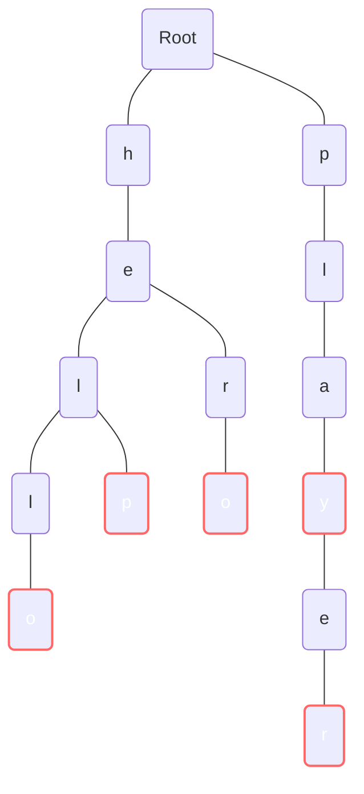

# Algorithms and Data Structures - Trie

## Description

Trie is pronounced as "try" and also known as a prefix tree. It is a tree-like data structure that stores a dynamic set of strings. Tries are commonly used to facilitate operations like predictive text or autocomplete features on mobile phones or web search engines. The name "trie" comes from the word "retrieval" because the trie can be used to retrieve a value given a key.

The trie is commonly used to work with strings, but it can be used with any sequence of objects if you can break them down into smaller parts.

Trie also is a specialisation of k-ary tree, where for example k can be the size of the alphabet or the number of possible characters in the input.

## Trie example

**Words**: `hello`, `help`, `hero`, `play`, `player`

## Asymptotic complexity

- `n`: Number of keys in the trie.
  - Previous example: 5 keys -> `hello`, `help`, `hero`, `play`, `player`
- `m`: Maximum length of a key in the trie.
  - Previous example: 6
    - `hello` -> 5
    - `help` -> 4
    - `hero` -> 4
    - `play` -> 4
    - `player` -> 6
- `k`: Number of possible characters in the input.
  - Previous example: 26 (alphabet)

### Time

| Operation   | Time Complexity | Description                                    |
|-------------|-----------------|------------------------------------------------|
| Insert      | `O(m)`          | Each character of a word of length`O(m)` may require traversal/creation of a node. |
| Search      | `O(m)`          | Searching involves traversing nodes from the root to a depth of `O(m)` corresponding to each character in the word. |
| StartsWith  | `O(m)`          | Similar to Search but for prefixes. Only needs to reach the depth where the prefix ends. |
| Delete      | `O(m)`          | Deletion requires finding the word (taking `O(m)` time) and then potentially modifying the endpoint and cleaning up any unused nodes. |

### Space
- Worst case space complexity is `O(n * m * k)`, where `k` is the number of possible characters in the input.
- Typically, the space complexity is `O(n * m)`.

## Demos

- [Trie with HashTable](./src/dotnet/WithHashTable/Program.cs)
- [Trie with Array](./src/dotnet/WithArray/Program.cs)

## References
- [Other algoritmos & Data Structures](https://github.com/NelsonBN/algorithms-data-structures)
